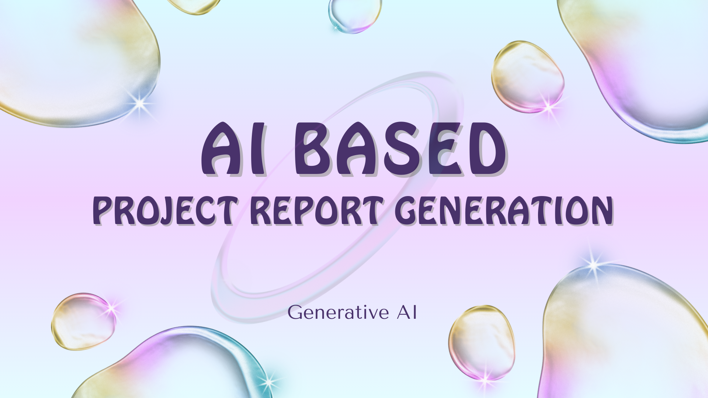

# AI based Project report Generation

How it works -> [Video]()

This project uses Django and Llama 2 to automatically generate comprehensive final year projects and reports based on user-provided domain and objectives.

## Features

- User-friendly interface for inputting project domain and objectives
- Utilizes [Llama 2](https://ai.meta.com/llama/) for intelligent content generation
- Ollama is used to load Llama2 model
- Langchain framework is used
- Django framework is employed
- Produces detailed project reports tailored to user inputs
- Streamlines the process of creating final year projects

## To run this app follow the below steps

1. Open Vscode and Clone the repository
2. Install dependencies
3. Install ollama from [HERE](https://ollama.com/)
4. Open cmd prompt and enter --- ollama run llama2
5. Restart vscode and follow below steps
6. Run the Django server (make sure to be inside project folder (reportgen))
7. Input your project domain and objectives
8. Receive a generated project report

## Technologies Used

- Django
- Llama 2 (Large Language Model)
- Langchain Framework
- Ollama2 - LLM model

## How It Works

1. **Frontend Interface**: Django serves a web page where users can input their project domain and objectives.

2. **Django Backend**: The user inputs are processed and passed to the backend through Django's views and models.

3. **Langchain Integration**: We use Langchain to interface with the Llama 2 model, setting up the environment and managing the interaction.

4. **Llama 2 Model**: The Llama 2 model, loaded via Oolama, processes the inputs using carefully crafted prompts to generate comprehensive project content.

5. **Report Generation**: Based on the model's output, a detailed project report is created, including methodologies, literature reviews, and implementation details.

6. **Logging**: Throughout the process, logs are created to track the model's progress and performance.

7. **Automatic Download**: Once the report is generated, it is automatically downloaded to the user's device, eliminating the need for manual intervention.

This pipeline allows for a seamless, automated, AI-driven approach to creating and delivering tailored final year projects based on user specifications.

## Contact

[Linkedin](https://www.linkedin.com/in/syed-atheequr-rahaman-ab6310214/])
